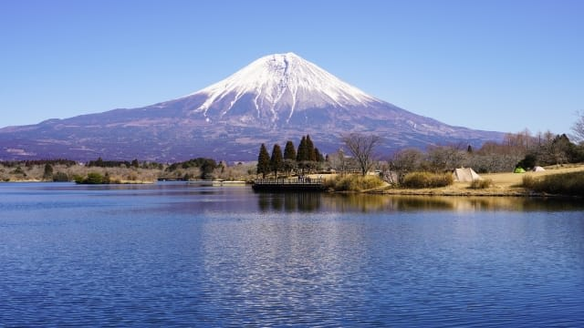

## 🌟 Beyond the Classroom
In my free time, I enjoy activities that help me relax and maintain a healthy work-life balance.

::: {layout-ncol=2}

::: {.card}
### 🎮 Gaming

**Dota 2 & Strategy**
I am an avid player of **Dota 2**. It helps me unwind while sharpening my strategic thinking. Coordinating with my team to secure a win is a rewarding challenge that keeps my mind active.
:::

::: {.card}
### ✈️ Travel

**Exploring Japan**
I love travelling to **Japan**; seeing Mount Fuji was a highlight. Exploring the unique blend of traditional culture and modern technology broadens my perspective and reminds me to appreciate different ways of life.
:::

:::