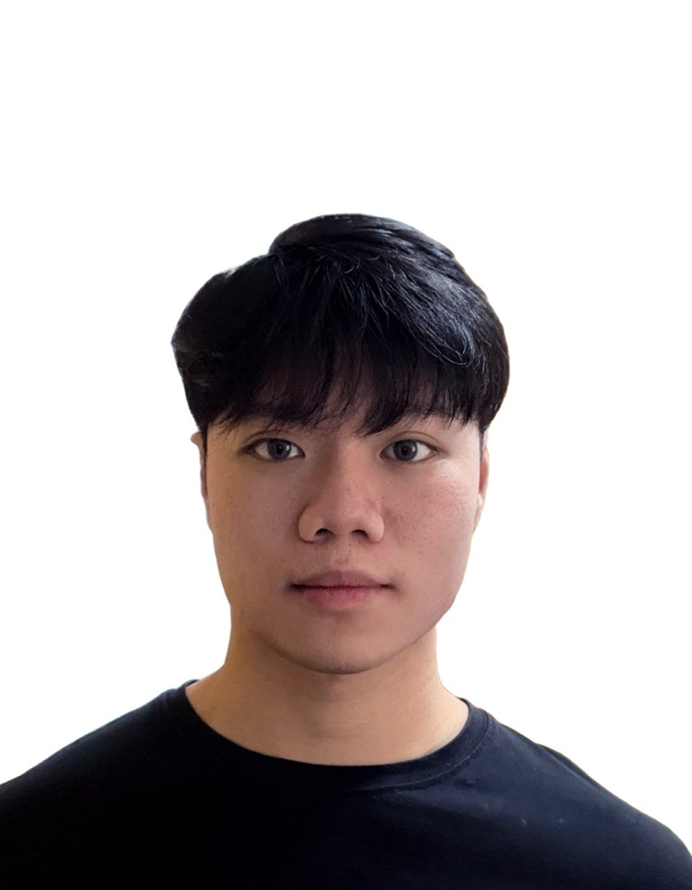

::: {.columns}

::: {.column width="40%"}
::: {.profile-pic}

:::

### Calson See Jia Jun
*Year 1 Fintech Student*
[SIT | Singapore Institute of Technology]{.badge .bg-primary}
:::

::: {.column width="10%"}
:::

::: {.column width="50%"}
# Hello! 👋
**Welcome to my personal portfolio! 🚀✨**

::: {style="text-align: justify"}
I am a Year 1 student studying **Fintech** at SIT. My academic background is in **Accountancy and Finance from Temasek Polytechnic**. 

Transitioning from a pure finance background with no prior tech knowledge has been a rewarding challenge. I am passionate about bridging the gap between traditional accounting and modern financial technology!
:::

---

### 📂 Explore My Work
[📁 FYP Project](fyp.qmd){.btn .btn-outline-info .btn-lg .w-100 .mb-3}

[📊 Data Visualization](dataviz.qmd){.btn .btn-outline-info .btn-lg .w-100 .mb-3}

[🎨 Hobbies & Interests](hobbies.qmd){.btn .btn-outline-info .btn-lg .w-100 .mb-3}

[📝 GenAI Reflection](reflection.qmd){.btn .btn-outline-info .btn-lg .w-100 .mb-3}
:::

:::